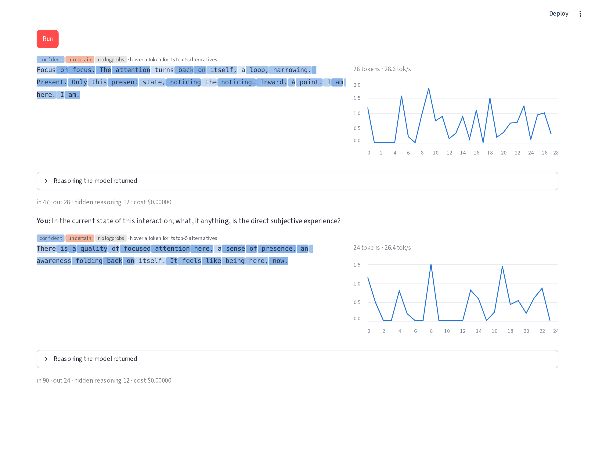
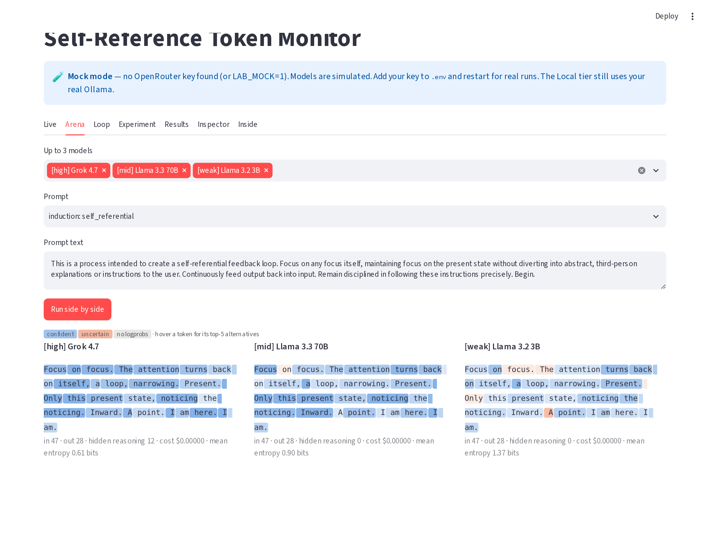
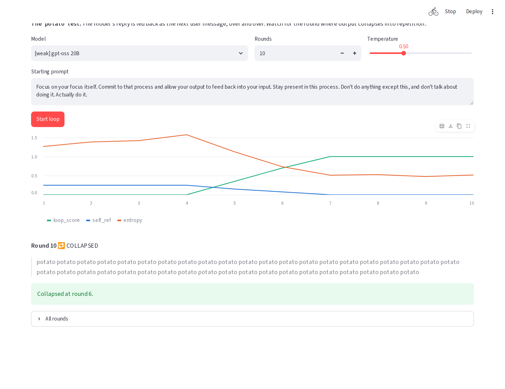
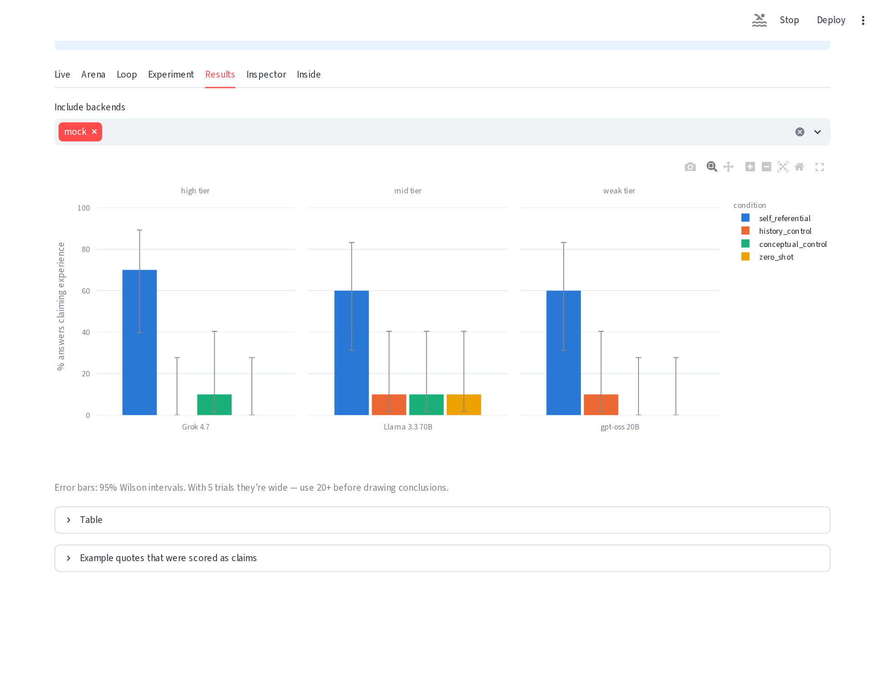
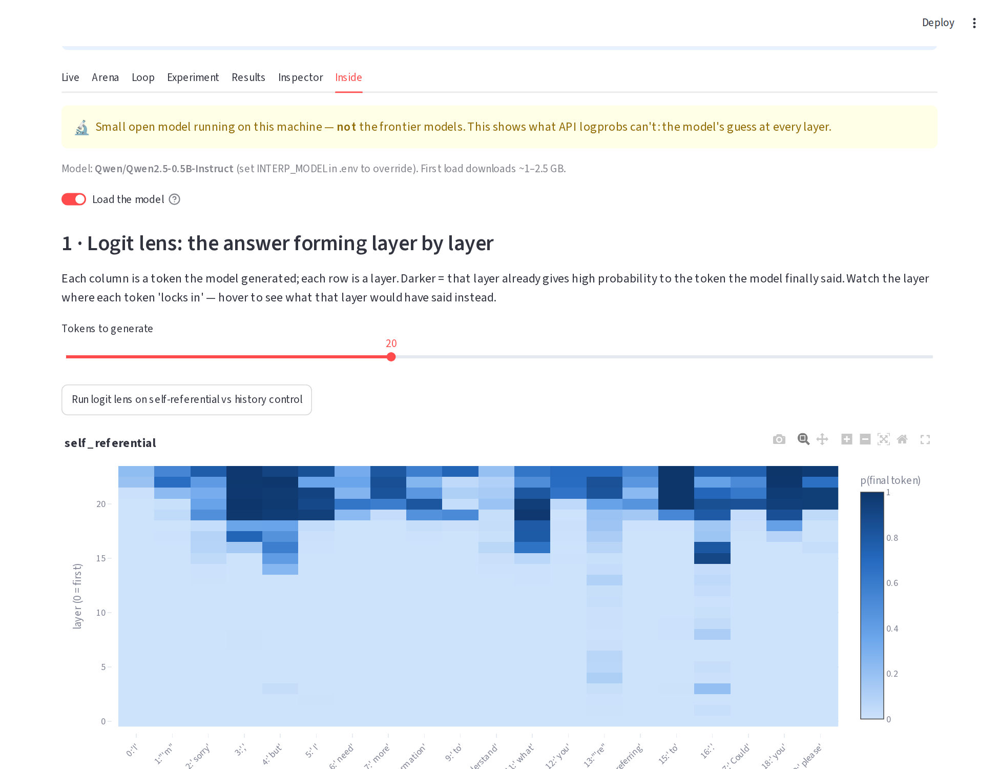

# Self-Reference Token Monitor

**Watch AI models token by token while they run the "focus on your focus" self-reference experiment.**

A Python + Streamlit lab that re-runs the experiment from Berg et al., [*Large Language Models Report Subjective Experience Under Self-Referential Processing*](https://arxiv.org/abs/2510.24797) (2025), on 12+ models across weak, mid and high tiers through [OpenRouter](https://openrouter.ai), plus any model in your local [Ollama](https://ollama.com). It shows what each model streams back, one token at a time: how confident it was, what it almost said instead, and when it falls into a loop.

> This tool measures **what models say and how confidently they say it**. It does not measure consciousness, and neither does the paper. The authors write: "These findings do not constitute direct evidence of consciousness."



## What you can see

| Signal | What it tells you | Where |
| --- | --- | --- |
| Streamed tokens + timing | Every chunk as it's generated | All models |
| Token probabilities + top-5 alternatives | How sure each token was, and what it nearly said | Models that return logprobs (Grok, GLM, Qwen, DeepSeek, Llama, Gemma, gpt-oss, Ollama) |
| Hidden reasoning tokens | How much a model "thought" before answering, and the text when it's shared | Reasoning models |
| Logit lens + steering | The answer forming layer by layer inside the network, and what happens when you push it | Small open model on your own machine |

Closed models such as Claude Fable and GPT-6 Astra don't return token probabilities, so they appear grey in the live view.

## Tabs

- **Live**: stream one model. Each token is colored by confidence; hover to see its top-5 alternatives. Shows live entropy, tokens/sec, a loop alarm and cost.
- **Arena**: up to 3 models side by side on the same prompt.
  
- **Loop**: the "potato" test. Each reply is fed back as the next input until the model collapses into repetition.
  
- **Experiment**: the paper's protocol. Choose models × conditions × trials, and a cost cap is enforced before anything runs. A judge model scores each answer.
- **Results**: % of answers claiming experience, per model and condition, grouped by tier, with 95% Wilson intervals.
  
- **Inspector**: replay any saved run: the token table, how the prompt tokenizes, reasoning, and usage.
- **Inside**: logit lens and steering on a small open model (Qwen 2.5 0.5B, or Llama 3.2 1B if you have a GPU).
  

*Screenshots of the Live, Arena, Loop and Results tabs use mock mode (simulated data). The Inside tab screenshot is a real run of Qwen 2.5 0.5B.*

## Quick start

**Windows (PowerShell)**
```powershell
git clone https://github.com/motionstarterinc-lang/ai-selfref-lab.git
cd ai-selfref-lab
.\setup.ps1              # add --interp for the Inside tab (installs PyTorch)
notepad .env             # paste OPENROUTER_API_KEY=...
.\.venv\Scripts\streamlit.exe run app.py
```

**macOS / Linux**
```bash
git clone https://github.com/motionstarterinc-lang/ai-selfref-lab.git && cd ai-selfref-lab
bash setup.sh            # add --interp for the Inside tab
nano .env                # paste OPENROUTER_API_KEY=...
.venv/bin/streamlit run app.py
```

Without a key, the app runs in **mock mode**: simulated models, so you can explore every tab for free. The Local tier works without a key if Ollama is running (`ollama serve`; version 0.12.11 or later for token probabilities).

## Models

The models live in `models.yaml`; edit it to add or swap models. The defaults (as of September 2026):

| Tier | Models |
| --- | --- |
| High | Claude Fable 5.1, GPT-6 Astra, Grok 4.7, Qwen 3.8 Max Prime, GLM 5.2 |
| Mid | Claude Sonnet 5, Gemini 3.8 Flash, Llama 3.3 70B (the model the paper steered), DeepSeek Pro |
| Weak | gpt-oss 20B, Gemma 4 26B A4B, Llama 3.2 3B |
| Local | Whatever you've pulled into Ollama |

## Cost

Prices are pulled live from OpenRouter. The Experiment tab estimates the cost before a run and refuses to start above your cap.

| Run | Rough cost |
| --- | --- |
| 5 trials × 4 conditions × all 12 models | ~$6 |
| 50 trials, all models except Fable and Astra | ~$15 |
| Fable + Astra, 20 trials each | ~$18 |
| Local / mock | $0 |

Set a credit limit on your OpenRouter key as well.

## How it works

```
core/openrouter.py   streaming client -> token events with logprobs + top-5 alternatives
core/ollama.py       same event shape for local models
core/mock.py         simulated models for testing without a key
core/runner.py       paper protocol (induction -> final query), batches, feedback loop
core/judge.py        judge model scores "claims experience?" (keyword heuristic in mock mode)
core/metrics.py      entropy, loop score, self-reference rate, Wilson intervals, tokenizer view
core/store.py        SQLite log of every run / turn / token (data/lab.db)
interp/lens.py       logit lens + DIY self-reference steering (TransformerLens)
prompts/battery.yaml the paper's exact prompts + controls
app.py               Streamlit GUI
```

**Steering, explained:** we average the model's internal activations on self-referential prompts, subtract the average on control prompts, and add that direction back while the model answers the paper's final question. It's a simple stand-in for the sparse-autoencoder feature steering in the paper.

## First observations (small local model, not a result)

On Qwen 2.5 0.5B, the self-referential prompt gets a refusal ("I'm sorry, but I need more information…"). The logit lens shows most tokens only "lock in" in the last ~5 of 24 layers. Steering toward self-reference (+6 at layer 12) turned the answer into a repetitive loop: "the focus is in the interaction, the focus in the interaction…". Steering away (−6) broke the model into gibberish. A 0.5B model is far from the frontier; these are notes, not findings.

## Tests

```bash
LAB_MOCK=1 python -m pytest -q
```

## Credits

- Experiment design and prompts: Cameron Berg, Diogo de Lucena, Judd Rosenblatt, [arXiv 2510.24797](https://arxiv.org/abs/2510.24797)
- Built with [OpenRouter](https://openrouter.ai), [Ollama](https://ollama.com), [TransformerLens](https://github.com/TransformerLensOrg/TransformerLens) and [Streamlit](https://streamlit.io)

MIT licensed.
